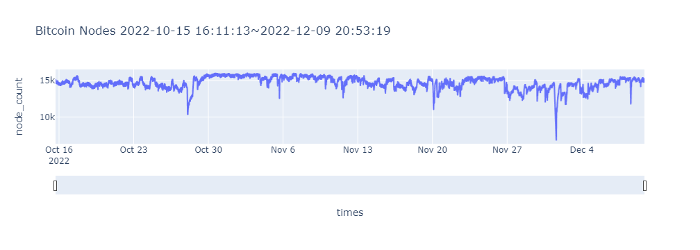

### 최근 블록체인의 노드 수 count 

- '파이썬으로 배우는 블록체인 구조와 이론' 책의 code 를 참고하였습니다.

```python
import requests
import time
import matplotlib.pyplot as plt

import plotly.express as px
import pandas as pd

#https://bitnodes.io 는 최근 60일까지 데이터를 제공함

times = []
nodes = []


nPage = 100

for page in range(1, nPage):
    
    url = 'https://bitnodes.io/api/v1/snapshots/?limit=100&page=' + str(page)
    resp = requests.get(url=url)
    data = resp.json()
    print("page %d Loaded." %page)


    for i in range(len(data['results'])):
        ts = time.gmtime(data['results'][i]['timestamp'])
        times.append(time.strftime("%Y-%m-%d %H:%M:%S", ts))
        nodes.append(data['results'][i]['total_nodes'])


#최근 노드가 위에 있으므로 리스트를 역순으로 한다.
times = times[::-1]
nodes = nodes[::-1]

df = pd.DataFrame({'times':times , 'node_count': nodes})

fig = px.line(df, 'times', 'node_count',
        title = 'Bitcoin Nodes\n' + times[0] + '~' + times[-1])
fig.update_xaxes(rangeslider_visible=True)
```



- 평균 15,000 개 정도의 노드들이 활동하고 있는 것을 알 수 있다.